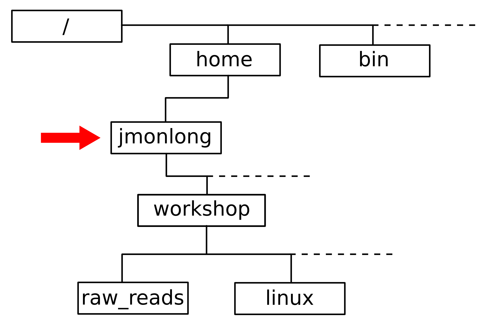

% Linux Basic
% Jean Monlong
% 29 March 2016

# Introduction

## What is Linux ?

- Free **operating system** for computers, similar to Unix (proprietary).
- **Many bioinformatics programs** run on Linux.
- Leading operating system on **supercomputers and servers**.

## Why is it good ?

- **Command-line** instructions.
- Work with **big files** easily.
- **Easier to develop** and run specific tools.
- Write **custom analysis** (scripting).
	
# What is a command ?

## The terminal

- This is where you write and execute commands.
- Open a Terminal.
- A command looks like this: `commandName arg1 arg2`
- Press *Enter* to run a command.

## Try some commands

~~~sh
> ls
> echo Hello
> man echo
~~~

- `ls` **L**i**S**t the files in the current directory.
- `man` open the **MAN**ual of a command. Useful to find details on arguments. Quit by pressing `q`.

## Tips

- Press **Tab** to auto-complete commands or paths.
- **Up/Down arrows** to navigate through previous commands.
- `clear` or **Ctrl-L** clear the screen.

# Files and folders

## Folder structure

At any moment you are in a directory, the *working directory*.

## Moving through folders

- `pwd` to **P**rint the **W**ordking **D**irectory.
- `cd` to **C**hange **D**irectory.
	- `..` represents the previous directory.
	- `/` is the directory separator.
	- `~` represents your root folder.

~~~sh
> pwd
/home/jmonlong
> ls
Documents  Dowloads  Pictures
> cd Documents
> pwd
/home/jmonlong/Documents
> cd ..
> cd Documents/workshop
~~~

## Exercise

1. Go to your `Documents` folder.
1. Create a directory `workshop`.
1. Go to the `workshop` folder.
1. Create a directory `linux`.

\

Note: `mkdir` to **M**a**K**e a **DIR**ectory.

## Solution

~~~sh
> cd ~/Documents
> mkdir workshop
> cd workshop
> mkdir linux
~~~

## Manipulate files

- `rm` **R**e**M**ove a file.
- `cp` **C**o**P**y a file.
- `mv` **M**o**V**e a file.

~~~sh
> cp file1 file2
> rm file1
> mv file2 file3
~~~

## Exercise

1. Move to your `Downloads` folder.
1. Download the annotation file located at [https://goo.gl/FLGAZH](https://goo.gl/FLGAZH).
1. Copy the file to the `linux` folder.
1. Remove the file in the `Downloads` folder.
1. Rename the file as `gencode.gtf` (using `mv` command)

\

Note: To download the file you can use:

~~~sh
> wget https://goo.gl/FLGAZH
~~~

## Solution

~~~sh
> cd ~/Downloads
> wget https://goo.gl/FLGAZH
> cp FLGAZH ../Documents/workshop/linux
> rm FLGAZH
> cd ../Documents/workshop/linux
> mv FLGAZH gencode.gtf
~~~

# Text files

## Commands

- `head`/`tail` print the first/last lines of a file.
- `cat` print the entire file.
- `less` to explore the text file.
- `nano` is a text editor. To open, change and save a file.
- `grep` retrieves lines containing a word or expression.
- `wc` retrieves the **W**ord **C**ount as well as the number of lines in a file.

## Exercise

1. Print the first lines of the annotation file.
1. Explore the file using `less`.
1. How many lines are in the file ?
1. Find the lines containing *ENSG00000278267*.

## Solution

~~~sh
> cd ~/Documents/workshop/linux
> head gencode.gtf
> less gencode.gtf
> wc gencode.gtf
> grep ENSG00000278267 gencode.gtf
~~~

# Compression

## Commands

- `gzip` to compress a file.
- `gunzip` to decompress a `.gz` file.
- `tar -xzvf file.tar.gz` to decompress and extract a `.tar.gz` file.
- `zless`/`zcat`/`zgrep` are `less`/`cat`/`grep` directly on gzip files.

## Example

~~~sh
> gzip gencode.gtf
> zgrep ENSG00000278267 gencode.gtf.gz
> gunzip gencode.gtf.gz
> tar -xzvf archive.tar.gz
~~~

# Pipes

## Pipes

- To *"pipe"* the output of a command into another command.
- Using `|`.
- More than two commands can be piped.

~~~sh
> zcat bigFile.gz | grep ENSG00000278267
> zcat bigFile.gz | grep ENSG00000278267 | head 
> zcat bigFile.gz | grep ENSG00000278267 | less
~~~

## Output redirection

- Instead of printing the results of a command.
- Use `>` to redirect it to a file.

~~~sh
> zcat bigFile.gz | grep ENSG00000278267 | head > gene1.gtf
~~~

# What's next ?

## What's next ?

- `ssh` and `scp`.
- `*` wildcard.
- Scripting.
- Custom batch profile (`.bachrc` file).
